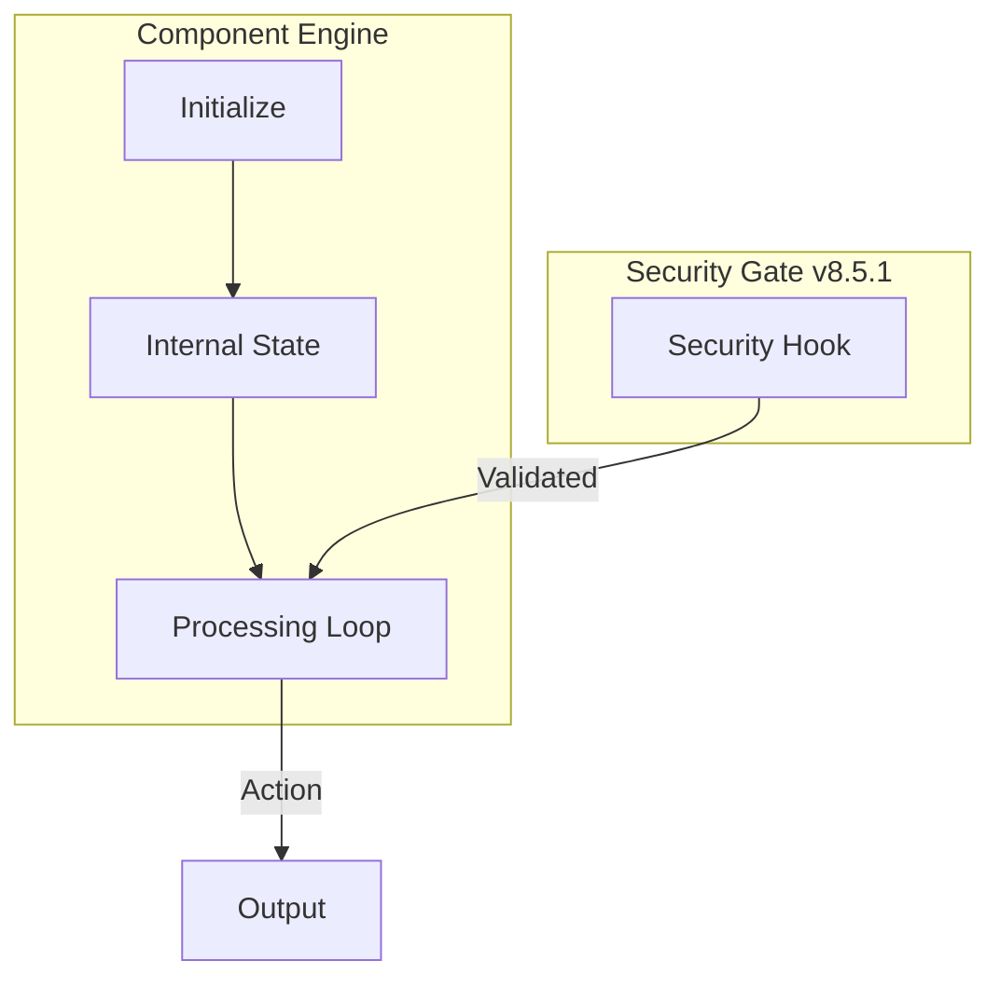

# 🚀 Update_mcp_configuration v8.5 // Celestial

The **Core Component** for the Gemini CLI ecosystem. Evolved into a **Hardened Agentic System** that enforces deterministic engineering through Harness guardrails.

## 🏗️ Celestial Architecture

## 🌟 Key Features (v8.5)
- **Harness Integration**: Full compatibility with Mitchell Hashimoto loops for deterministic state transitions.
- **Celestial Standards**: Upgraded for the v8.5 ecosystem with real-time tracking.
- **Native Security**: Integrated with the mandatory pre-commit validation hook (v8.5.1).

## 🛡️ Security Policy
This repository follows the global ecosystem [Security Policy](../SECURITY.md).

---
**Standardized by Gemini CLI** | *v8.5.1 Deployment Active*
